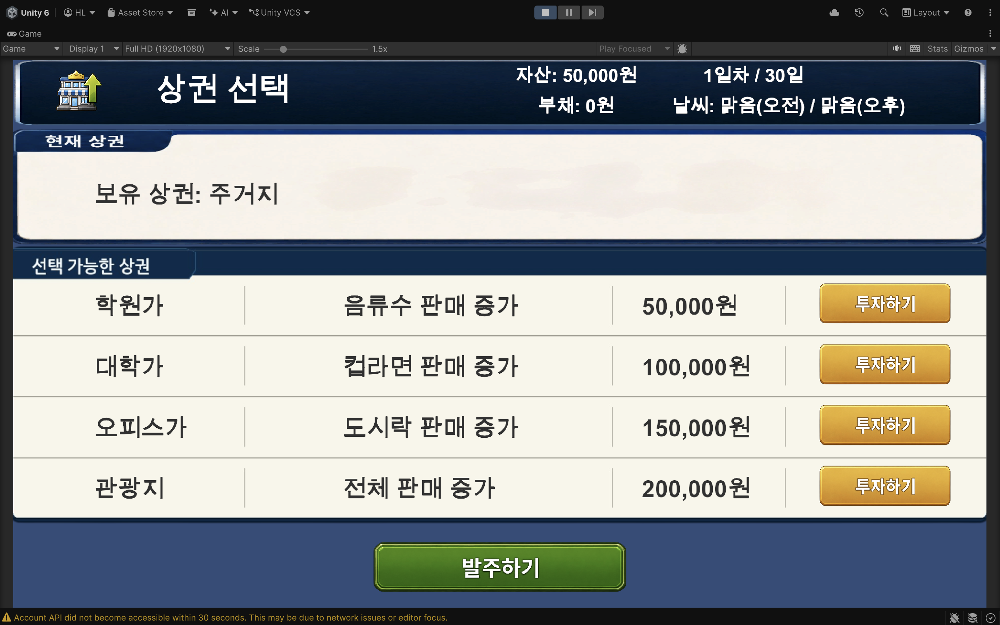
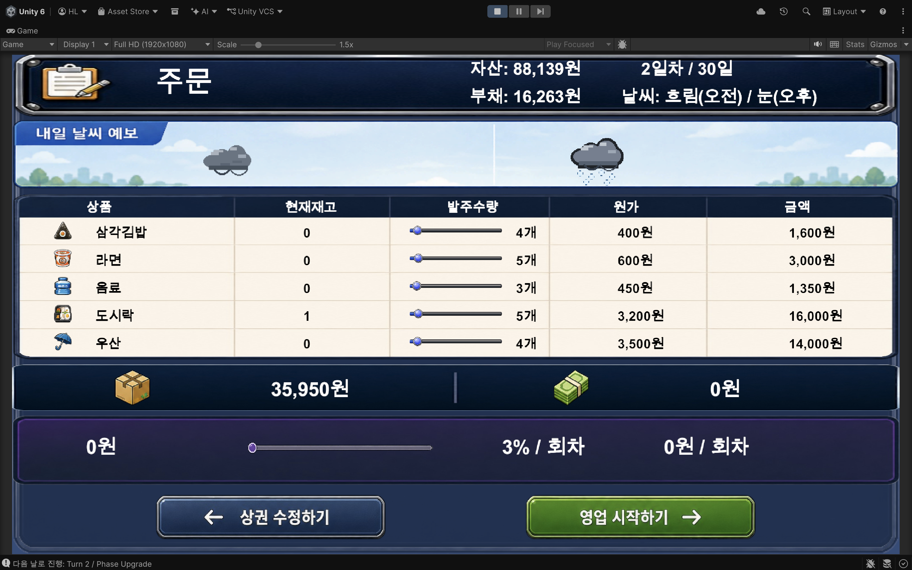
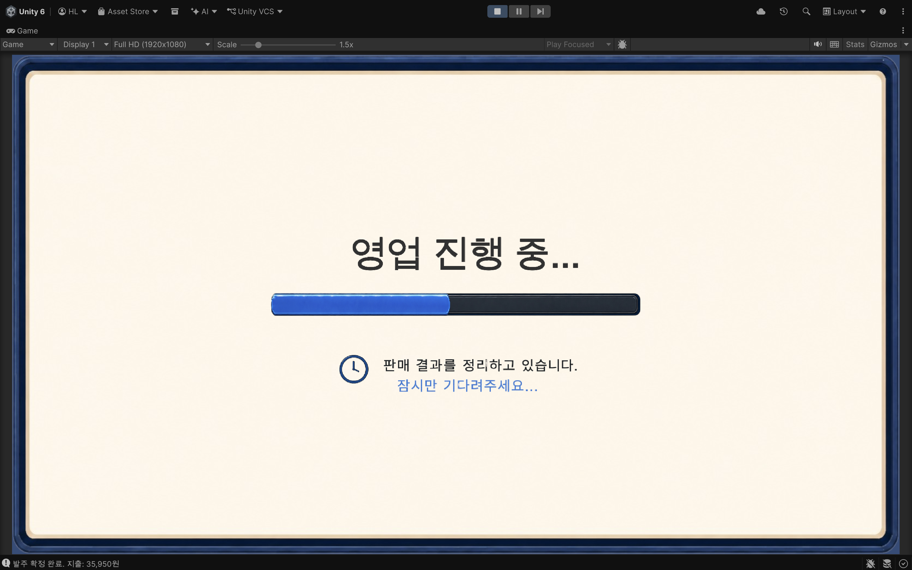
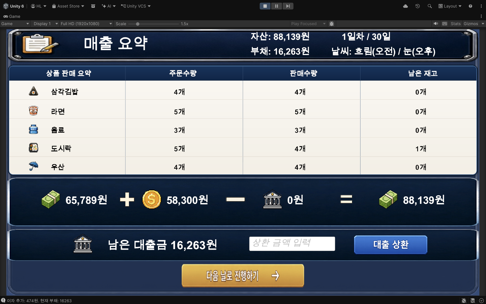

# 세종편의점

세종대학교 OpenSource 강의에서 제작한 Unity 기반 2D 편의점 경영 시뮬레이션입니다.
플레이어는 상권 투자, 상품 발주, 날씨 대응, 대출 관리, 재고 운영을 통해 30턴 안에 목표 매출 500만원을 달성해야 합니다.

[](https://github.com/SejongOpenSource/OpenSource)

## 스크린샷

| Upgrade (상권 선택) | Order (발주) |
|---|---|
|  |  |

| Simulation (영업 진행) | Result (매출 요약) |
|---|---|
|  |  |

## 프로젝트 개요

| 항목 | 내용 |
|------|------|
| 과목 | OpenSource |
| 프로젝트 유형 | 팀 프로젝트 |
| 개발 기간 | 2026.05 ~ 2026.06 |
| 버전 관리 | GitHub Flow |
| 엔진 | Unity 6.3 LTS (`6000.3.14f1`) |
| 저장소 | https://github.com/SejongOpenSource/OpenSource |

## 게임 목표

| 항목 | 내용 |
|------|------|
| 승리 조건 | 누적 매출 **500만원** 달성 |
| 패배 조건 | 자본금 **0원 미만** 또는 **30턴 초과** |
| 초기 자본금 | 5만원 |
| 최대 턴 | 30턴 (1턴 = 1영업일) |

### 점수 산정

**점수 공식**: `(30 - 달성 턴) × 10,000 - 잔여 재고 원가 - 잔여 대출 잔액`

## 핵심 루프

```text
Upgrade -> Order -> Simulation -> Result
```

- `Upgrade`: 상권 투자 결정
- `Order`: 상품 발주, 날씨 확인, 대출 처리
- `Simulation`: 영업 시뮬레이션 자동 진행
- `Result`: 매출·재고 확인, 대출 상환

## 주요 시스템

| 클래스 | 역할 |
|--------|------|
| `GameManager` | 전체 시스템 조율, 승패 이벤트 관리 |
| `TurnManager` | 턴·페이즈 전환, 대출 이자 적용 |
| `SalesAlgorithm` | 상품 선택 확률 계산 및 판매 시뮬레이션 실행 |
| `StoreManager` | 자본금, 상권, 대출 잔액 관리 |
| `InventoryManager` | 재고 수량 관리 |
| `WeatherSystem` | 날씨 생성 |
| `CustomerManager` | 상권·날씨 기반 일일 방문객 수 산출 |
| `DataManager` | 상품·상권·날씨 데이터 조회 |

## 데이터 구성

### 상품 (5종)

| 상품 | 원가 | 판매가 | 마진 |
|------|------|--------|------|
| 삼각김밥 | 400원 | 1,200원 | 800원 |
| 컵라면 | 600원 | 1,300원 | 700원 |
| 음료수 | 450원 | 1,000원 | 550원 |
| 도시락 | 3,200원 | 5,000원 | 1,800원 |
| 우산 | 3,500원 | 6,000원 | 2,500원 |

손님은 상권·날씨에 따른 확률 가중치로 상품을 선택하며, 재고가 없으면 구매가 무효 처리됩니다.

### 날씨 효과

| 날씨 | 오전 발생 확률 | 방문객 수 보정 | 상품 판매 보정 |
|------|---------------|----------------|----------------|
| 맑음 (Sunny) | 35% | ×1.0 | 변동 없음 |
| 흐림 (Cloudy) | 30% | ×0.8 | 변동 없음 |
| 비 (Rainy) | 25% | ×0.9 | 우산 ×2.0 |
| 폭염 (Heatwave) | 5% | ×1.05 | 음료수 ×1.5 |
| 눈 (Snowy) | 5% | ×0.7 | 변동 없음 |

### 상권

| 상권 | 투자 비용 | 방문객 배수 (계산식: 1 + visitorBonus) | 주요 효과 |
|------|-----------|---------------------------------------|-----------|
| 주택가 (Resident, 기본) | 무료 | x1.0 (+0%) | 시작 상권 |
| 학원가 (Academy) | 50,000원 | x1.8 (+80%) | 삼각김밥·컵라면 ×1.5 |
| 대학교 (Campus) | 100,000원 | x2.5 (+150%) | 음료수 ×1.4 |
| 오피스 (Business) | 150,000원 | x2.75 (+175%) | 도시락 ×1.8 |
| 관광지 (Tourist) | 200,000원 | x3.5 (+250%) | 전 상품 ×1.3 |

> 상권은 한 번 구매하면 영구 잠금 해제됩니다. 이미 구매한 상권은 이후 턴에 추가 비용 없이 재선택할 수 있으며, 동시에 적용되는 상권은 하나입니다.

### 대출

| 항목 | 내용 |
|------|------|
| 1회 대출 한도 | 200,000원 |
| 최대 누적 대출 | 400,000원 |
| 이자율 | 잔액의 3% / 턴 |
| 상환 | Result 단계에서 자유 상환 |

## 실행 방법

```bash
git clone https://github.com/SejongOpenSource/OpenSource.git
```

1. [Unity Hub](https://unity.com/download)에서 **Unity 6000.3.14f1** 설치
2. 클론한 프로젝트를 Unity Hub로 열기
3. `Assets/Scenes/MainMenu.unity` 실행
4. Play 버튼으로 게임 시작

### Unity Git 설정

- **Version Control** → Visible Meta Files
- **Asset Serialization** → Force Text
- `Library/`, `Temp/`, `Logs/` 등은 `.gitignore`로 제외
- `*.meta` 파일은 반드시 커밋

## 프로젝트 구조

```text
Assets/
├── Scenes/
│   ├── MainMenu.unity
│   ├── PlayerEconomy.unity
│   └── SampleScene.unity        # Unity 기본 제공 씬 (미사용)
├── Scripts/
│   ├── Manager/
│   ├── Player/
│   ├── Data/
│   └── UI/
├── Resources/
└── Sprites/
```

## 개발 프로세스

이 프로젝트는 GitHub Flow 기반으로 협업합니다.

```
main
  ↑
  PR
  ↑
feat/xxx
```

### 작업 순서

1. Issue 생성 - `.github/ISSUE_TEMPLATE/issue_template.md` 사용
2. 브랜치 생성 - `feature/기능명` 형식
3. 작업 및 커밋 - Conventional Commits 사용
4. Pull Request - `.github/pull_request_template.md` 작성
5. 코드 리뷰 후 `main` 병합
6. 병합 후 브랜치 자동 삭제 - `.github/workflows/delete-merged-branch.yml`

### 커밋 컨벤션

| 접두어 | 용도 |
|--------|------|
| `feat:` | 새 기능 |
| `fix:` | 버그 수정 |
| `docs:` | 문서 변경 |
| `refactor:` | 리팩토링 |
| `test:` | 테스트 |

## 팀원

| GitHub | 역할 | 담당 |
|--------|------|------|
| [theFireFly-Night](https://github.com/theFireFly-Night) | PM | 프로젝트 관리, 씬 통합, PR 리뷰, 핵심 기능 |
| [nonactress](https://github.com/nonactress) | 팀원 | 게임 코어 로직 (Manager, Data) |
| [hlee0](https://github.com/hlee0) | 팀원 | UI 패널, HUD |
| [dong11ro](https://github.com/dong11ro) | 팀원 | 핵심 기능 및 서브 기능 |


## 📄 라이선스 및 크레딧 (License & Credits)

본 프로젝트는 세종대학교 OpenSource 강의의 팀 프로젝트입니다. 프로젝트 코드와 구조에 대한 저작권은 팀원에게 있으며, 저장소에 포함된 외부 에셋은 각 원저작자의 라이선스를 준수합니다.

### 🎵 배경 음악 (BGM)
* **메인 화면 및 인게임 배경음악**
  * **에셋명:** [Free Music Pack - Lo-Fi, Indie, Metal, Horror, Orchestral Loops](https://assetstore.unity.com/packages/audio/music/orchestral/free-music-pack-lo-fi-indie-metal-horror-orchestral-loops-281109)
  * **제작자:** WOW Sound
  * **라이선스:** [Unity Standard Asset License Extension](https://unity.com/legal/as-terms) (상업적 이용 가능, 크레딧 표기 의무 없음)

### 🔊 효과음 (SFX)
* **편의점 문 벨소리 (Door Chime)**
  * **사운드명:** [Convenience Store Door Chime (32bit, 48kHz, Stereo)](https://freesound.org/people/zebragrrl/sounds/632225/)
  * **제작자:** zebragrrl (Based on Taira Komori)
  * **라이선스:** [CC BY 4.0](https://creativecommons.org/licenses/by/4.0/) (출처 표기 필수, 상업적 이용 및 수정 가능)

* **냉장고 구동음 (Refrigerator Hum)**
  * **사운드명:** [Humming Refrigerator](https://freesound.org/people/Ironlink15/sounds/353797/)
  * **제작자:** Ironlink15
  * **라이선스:** [CC0 1.0 Universal](https://creativecommons.org/publicdomain/zero/1.0/) (Public Domain, 출처 표기 의무 없음)

* **화폐 동전 소리 (Money Drop)**
  * **사운드명:** [Loose Change Drop On Wooden Floor](https://freesound.org/people/modusmogulus/sounds/794903/)
  * **제작자:** modusmogulus
  * **라이선스:** [CC BY 4.0](https://creativecommons.org/licenses/by/4.0/) (출처 표기 필수, 상업적 이용 및 수정 가능)

* **바코드 스캐너 소리 (Barcode Scanner)**
  * **사운드명:** [Barcode Scanner Beep](https://freesound.org/people/magnuswaker/sounds/555061/)
  * **제작자:** magnuswaker
  * **라이선스:** [CC0 1.0 Universal](https://creativecommons.org/publicdomain/zero/1.0/) (Public Domain, 출처 표기 의무 없음)

* **타이틀 UI / 게임 오버 효과음 (Title & Game Over SFX)**
  * **사운드명:** [8-Bit Game Over Sound (Alternative)](https://freesound.org/people/Mrthenoronha/sounds/513427/)
  * **제작자:** Mrthenoronha
  * **라이선스:** [CC0 1.0 Universal](https://creativecommons.org/publicdomain/zero/1.0/) (Public Domain, 출처 표기 의무 없음)

---
💡 본 프로젝트의 외부 리소스 라이선스 관련 문의나 이의가 있으실 경우, GitHub Issue를 통해 제보해 주시면 즉각 반영하도록 하겠습니다.
